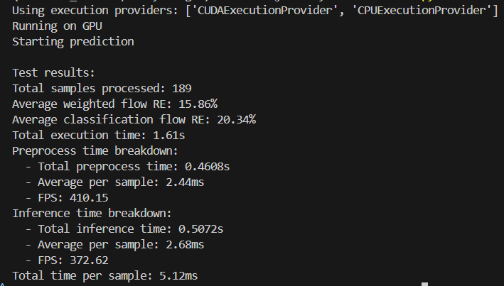

# A Lightweight Neural Network for Pipeline Flow Rate Monitoring Using Distributed Acoustic Sensing

This repository contains the official implementation of the paper:

A Lightweight Neural Network for Pipeline Flow Rate Monitoring Using Distributed Acoustic Sensing

Anonymous

---

The paper is currently under review, and we plan to release the full code depending on the results of the peer review.

## 📰 CODE RELEASE

- [x] (2025.07.06) Release onnx model checkpoint, test dataset, and inference script.
- [ ] Release training codes and full datasets.

## 💻 Start Inference

```shell
python onnx_test.py
```

The output example is as follows


